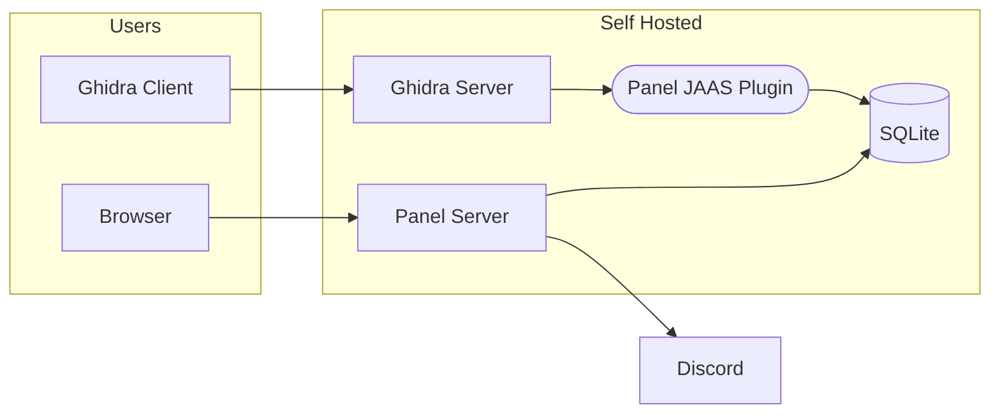

# Ghidra Community Panel

The Ghidra community panel assists with collaborative reverse engineering.  It features:

- A self-service panel to allow users to set their Ghidra password
- An admin panel to manage user access

This repository is not an official Ghidra project.

## Design

`ghidra-panel` introduces the following components:

- An [SQLite database] storing hashed user credentials
- A [JAAS plugin] implementing a Ghidra authentication provider
- A panel web server, written in [Go]
- A Discord OAuth2 integration to authenticate users,
  and link Ghidra usernames to Discord usernames
  - Discord was chosen because all RE communities I've worked with use it
  - I'm open to adding OAuth 2.0 / OpenID Connect to support other SSO providers

  [SQLite database]: https://www.sqlite.org/index.html
  [JAAS plugin]: https://docs.oracle.com/javase/8/docs/technotes/guides/security/jaas/JAASRefGuide.html
  [Go]: https://go.dev/
  [Discord OAuth2]: https://discord.com/developers/docs/topics/oauth2

## Philosophy

This software serves a hobbyist community with limited time.
As such, it aims to be simple, reproducible, and easy to maintain. 

This rules out extensive use of external software, such as libraries,
database servers, auth servers, etc. Any such software would require
continuous updating.

This further means:
- No fancy IdP or access controls
  - [Keycloak](https://www.keycloak.org/) looked promising, but
    its JAAS adapter is [deprecated](https://www.keycloak.org/docs/22.0.1/securing_apps/#keycloak-java-adapters)
- A Go-based web server is a safe choice, as the standard library
  contains almost everything we need
- Web pages rendered server-side

## Acknowledgements

This panel currently powers [mkw.re](https://mkw.re), a shared space for Mario Kart Wii modding communities.
Thank you to the countless contributors that have checked in research to the existing Ghidra repos!

Special thank you for [@stblr](https://github.com/stblr) for his efforts to unite the MKW community and donating the `mkw.re` domain.

Thank you to the SQLite project for making my life easier.
